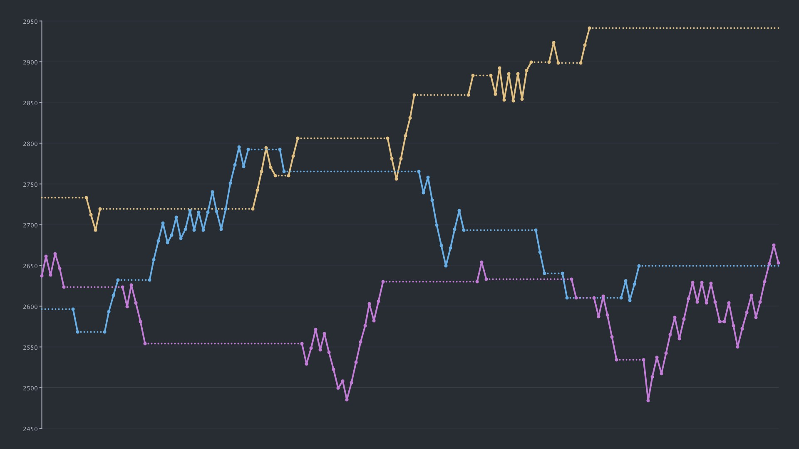

**A Processing project to graph Overwatch SR.**

*An alternative graphing style can be found in the* [horizontal-redo](https://github.com/LucasDower/overwatch-sr/tree/horizontal-redo) *branch*. 



## Useage
Each role in Overwatch has its own .txt file, found in the `/data/` folder, storing the SR of the player throughout the player's career.

Currently, everytime you win, lose, or draw a competitive game, you need to record your new SR in the appropriate .txt file.

#### Formatting
All SR should be recorded separately on new lines.

Competitive seasons can bee split into their own lines on the graph. A label must be given before the SR numbers, to denote this surround the label text with `<>`. The text within can be anything, but it's probably most useful to display what season the SR is referring to. In the example below, you could equally have `<Season 17>` instead of `<S17>`.

*Labels are just used to break up the SR into separate lines.*

**Each of the role files must have at least one label (the one at the top).**

#### Example
```
<S17>
2592
2613
2586
2605
2630
2652
2675
2653
<S18>
2675
2701
2720
2747
2724
2705
2728
2704
2730
```

## Installation
Download [Processing](https://processing.org/), download these project files and open using *Processing*.

*An executable version might be available in another branch in the near future.*
